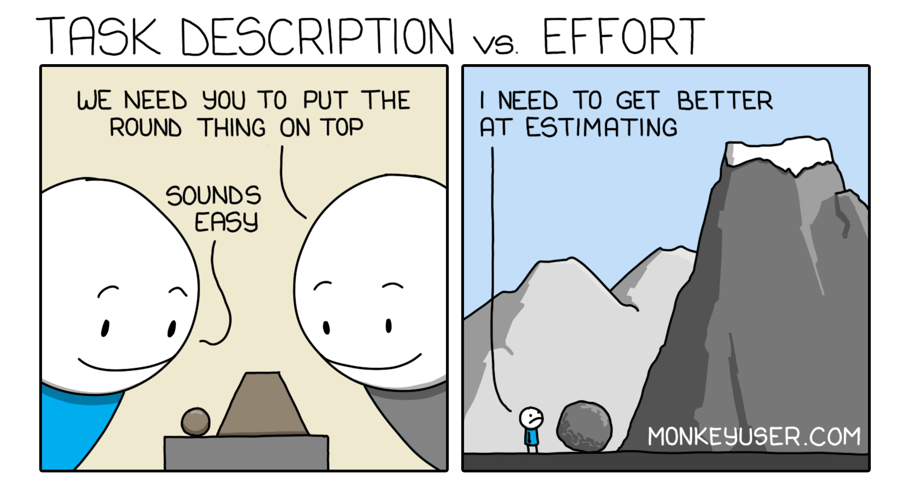

```{r setup, include=FALSE}
knitr::opts_chunk$set(echo = FALSE)
```

I have invested a lot of effort into the development of mizer over the last 7
years and intend to continue doing so, hopefully with the help from many others
(you can see a list of contributors here:
https://github.com/sizespectrum/mizer/graphs/contributors). Why is all this
effort justified?


```{r fig.cap="Comic from https://www.monkeyuser.com", out.extra="class=external", preview=TRUE}

```

It is our goal in the mizer community to make mizer the go-to tool for anyone
wanting to study multi-species effects in aquatic ecosystems. Of course we are
convinced that due to the indeterminate food-dependent growth of fish and the
fact that a fish traverses several trophic levels throughout its life,
size-spectrum models are the only appropriate tool. The goal is that the hurdle
to setting up a new multi-species model in mizer is lower than the hurdle to do
so in any other way, including in particular Ecopath with Ecosim, which is
currently often used in spite of the fact that its food-web philosophy does
not match the reality of how fish species interact.

Clearly the ecosystem-based approach to understanding and managing fisheries
will become more and more important in the coming years. So a tool like mizer is
sorely needed.

I took over the development of mizer in 2014, shortly after the publication of
the first paper presenting mizer version 0.3 to the world. There have been many
advances in mizer since then, which have never been properly publicised. Some of
the advances involve important changes in philosophy that have transformed the
way one uses mizer. This was a long and sometimes tortuous evolution prompted by
difficulties encountered while using mizer. I think an account of these changes
is overdue, and I intend to use a series of blog posts to provide such an
account. This is easier now than at the time of the original development,
because some of the dust has now settled.

From the outset, mizer had been envisaged as a modelling platform that would
serve the research interests of a wide-range of fisheries scientists and marine
ecologist and would be adaptable to answer new research questions as they arise.
The visionary idea of the original authors (Ken Andersen, Julia Blanchard and
Finlay Scott) was that a universal platform for studying size-spectrum models
would enable faster progress and easier exchange of ideas within the community
than if every researcher would start coding their simulations from scratch. By
using mizer, researchers could build on each other’s models. It would be easier
to conduct comparison of effects across ecosystems, see  for a recent example.

There were two areas where much development had to take place on the way to
realising this visionary idea. Two initial shortcomings of the early versions of
mizer had to be overcome:

1. In the original version, researchers who wanted to adapt mizer to their own
work had to create a fork of the mizer code and make changes to that code. If
they wanted to enable others to reproduce their results they needed to share not
only their model parameters but also the entire modified mizer code base. So
there started to be different variants of mizer, quickly evolving into distinct
species that could not cross-fertilise any more.

2. Creating a new multi-species model that accurately described a given
ecosystem was very difficult and time-consuming. For newcomers it was not even
clear where to start with the process. Much time had to be spent to even just
get the desired community of species to coexist. It was not feasible to just
give mizer to a Ph.D. student and expect them to do something useful in an
acceptable timeframe.

The current version of mizer is far from being near the end of its development.
Quite to the contrary: development is accelerating as the power of the code-base
increases. But it has reached a stage where the above two shortcomings are much
less pronounced. There are now enough customisation options and a sufficiently
flexible extension mechanism that mizer can be adapted to a wide range of new
research questions without any modifications to the mizer code. And there are
sufficiently powerful and user-friendly tools to quickly create new models and
calibrate them to observations.

I intend to organise the presentation of these mizer developments into 10 blog
posts (I know that sounds like rather a lot, but I think more short posts are
easier than fewer longer posts). The following potential titles probably won’t
tell you much, and they may well change when I get around to writing the posts,
but here is the list:

1. The initial size-spectrum is part of the model
2. Tools for finding the steady state
3. Shiny gadget for tuning the steady state
4. A model can change
5. The three sources of external density-dependence
6. The four levels of customisation of a mizer model
7. Scaffolding for models with few species
8. Extending a model with extra ecosystem components
9. Fast numerics with FFT for convolution integrals
10. Exact scale-invariant model with an analytic solution

This post was rather dry and wordy. Future posts will include mizer code
examples. 
