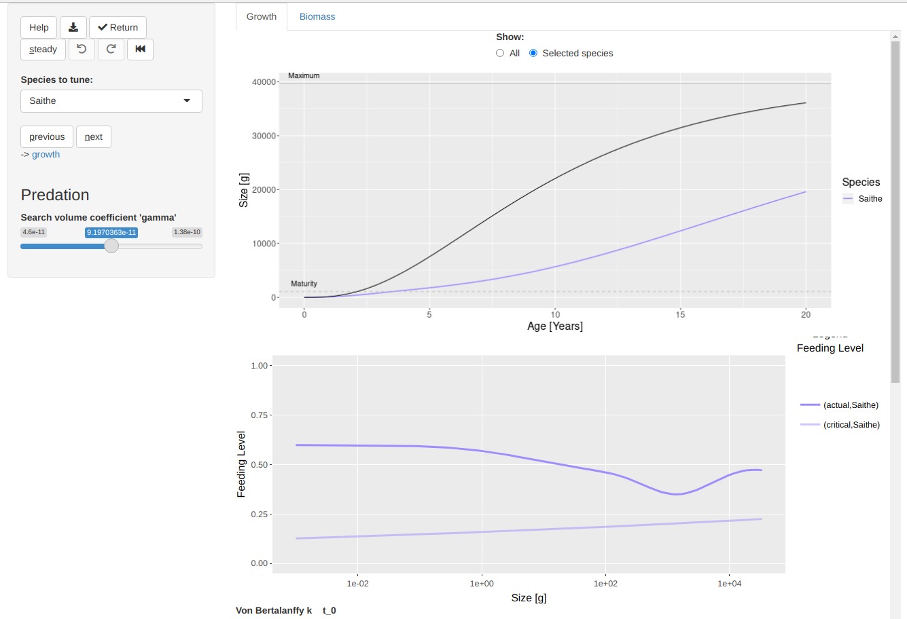

```{r setup, include=FALSE}
knitr::opts_chunk$set(echo = TRUE)
library(mizerExperimental)
```

# Introduction

In a [previous blog post](https://bit.ly/2YqXESV) I presented a new method for
tuning a mizer model to reproduce observed values for species biomasses. In
the example I used there, after matching the biomasses also the growth curves
had a pretty good agreement with observations. However I already warned you
that that was unusual, and that you are highly unlikely to have similar luck
with your own model. So in this blog post I will show you what to do if the
growth curves in your model need to be adjusted.

This will give me an opportunity to introduce you to the mizer tuning gadget,
which is an amazing interactive tool that eventually will be useful for
much more than just matching growth curves.

# Setting up an example

I will use the same species parameters and gear parameters for a North Sea model
that I used in my [previous blog post](https://bit.ly/2YqXESV), but I will now
also use the species interaction matrix `NS_interaction` that comes as an
example with mizer, and which encodes that, due to only partial spatial overlap,
not all species interact with each other with the same strength. With
those parameters we can create the mizer model and make an initial plot
of the steady state:

```{r include=FALSE}
# Here is how I obtained the example species_params:
species_params <- NS_species_params
species_params$R_max <- NULL
species_params$a <- c(0.007, 0.001, 0.009, 0.002, 0.010, 0.006, 0.008, 0.004,
                         0.007, 0.005, 0.005, 0.007)
species_params$b <- c(3.014, 3.320, 2.941, 3.429, 2.986, 3.080, 3.019, 3.198,
                         3.101, 3.160, 3.173, 3.075)

years <- getTimes(NS_sim) >= 1990 & getTimes(NS_sim) <= 2010
# Average biomass above w_mat/20
bm_hist <- getBiomass(NS_sim, min_w = species_params$w_mat / 20)[years, ]
species_params$biomass_observed <-  colSums(bm_hist) / 21

# Average fishing mortality
f_location <- system.file("extdata", "NS_f_history.csv", package = "mizer")
f_history <- as(read.csv(f_location, row.names = 1), "matrix")[years, ]
f <- colSums(f_history) / 12

gear_params <- 
    data.frame(gear = "All",
               species = NS_species_params$species,
               sel_func = "sigmoid_length",
               l25 =  c(7.6, 9.8, 8.7, 10.1, 11.5, 19.8, 16.4, 19.8, 11.5,
                        19.1, 13.2, 35.3),
               l50 = c(8.1, 11.8, 12.2, 20.8, 17.0, 29.0, 25.8, 29.0, 17.0,
                       24.3, 22.9, 43.6),
               catchability = f)
```

```{r}
params <- newMultispeciesParams(species_params = species_params,
                                gear_params = gear_params,
                                interaction = NS_interaction,
                                initial_effort = 1)
params <- steady(params)
plotlySpectra(params, power = 2)
```

As discussed in that previous post, matching to the observed biomasses is easy:

```{r}
params <- params |> calibrateBiomass() |> matchBiomasses() |> steady() |>
    calibrateBiomass() |> matchBiomasses() |> steady() 
plotBiomassVsSpecies(params)
```

The matching did not work quite so well for Saithe, and it will become clear
in a moment why that is. Let us plot the growth curves:

```{r}
plotGrowthCurves(params, species_panel = TRUE)
```

It is clear to see that the growth is too low for all species, but particularly
so for Saithe. 

```{r}
plotGrowthCurves(params, species = "Saithe")
```

Saithe takes almost twice as long to reach maturity as is predicted by the 
von Bertalanffy growth curve. So we need to do some tuning.
Before we start with that, we'll save the current state into a new variable.

```{r}
params_start <- params
```

If you want to try things for yourself, you can load this example MizerParams
object with

```{r eval=FALSE}
params_start <- params <- readRDS(url("https://bit.ly/3jSNAKF"))
```


# How difficult it was in the past

Now I am going to try to get the growth curve of Saithe in the model to agree
with the observed growth curve, without using the new tuning gadget. I am doing
that because it might be useful to understand what goes on under the hood in the
tuning gadget. But I am also doing it to show off how much of an advance the
tuning gadget represents. So let's start.

Clearly we need to get Saithe to feed more rapidly. We can do that by increasing
the coefficient `gamma` in the search volume.  We don't know how much we need to
increase `gamma` exactly, so we try a factor of 2.

<aside>If you want to learn more about
how growth is modelled in mizer, take a look at the
[relevant section](https://sizespectrum.org/mizer/articles/model_description.html#growth-2)
in the mizer model description.</aside>

```{r}
species_params(params)[["Saithe", "gamma"]] <- 
    2 * species_params(params)[["Saithe", "gamma"]]
plotGrowthCurves(params, species = "Saithe")
```

That helped, but is not enough. So we can try again, increasing `gamma`
a bit further. With a little trial and error I determined that an extra factor
of 1.4 would do the trick.

```{r}
species_params(params)[["Saithe", "gamma"]] <- 
    1.4 * species_params(params)[["Saithe", "gamma"]]
plotGrowthCurves(params, species = "Saithe")
```

Unfortunately, while we have fixed the growth curve by changing `gamma`, we have
at the same time messed up other aspects of the model. For one thing, our
initial spectra don't represent a steady state any more. So we have to use
`steady()` again:

```{r}
params <- steady(params)
```

Now this has allowed the full effect of multi-species interaction to take hold
and, due to increased competition, the growth curve of Saithe is again trailling
behind observations.

```{r}
plotGrowthCurves(params, species = "Saithe")
```

But not only that. We have also messed up the biomasses of some of the species,
in particular Gurnard and Haddock, as it turns out:

```{r}
plotBiomassVsSpecies(params)
```

Of course we know how to correct that:

```{r}
params <- params |> calibrateBiomass() |> matchBiomasses() |> steady()
plotBiomassVsSpecies(params)
```

But there is another aspects of the model that we have messed up. Let's
plot the feeding level.

```{r}
plotFeedingLevel(params)
```

The feeding level describes how satiated a fish is. The closer to 1, the 
more satiated the fish is and the less sensitive it therefore is to changes in
prey availability. We have now made Saithe less sensitive than other species,
without actually intending to do that. What we probably should have done is
to change the parameter `h` that controls the maximum intake rate, and thus
the density dependence in feeding, at the same time as `gamma` so as to keep
the feeding level constant, at least for larvae.

I think this is enough to explain what is involved in tuning a model to
reproduce the desired growth curves and to demonstrate that it was a very
tedious task in the past. We have only partially dealt with the growth curve of
a single species and already are exhausted. 

# How easy it is now

The previous section showed us that tuning model parameters by hand is very
tedious and it will take ages before we have the model in the shape we want it
to be in. I'll now discuss how to do it much faster. 
There are three things we need to do to make this faster solution possible:

1. Make the process interactive so that we can just click around with the mouse
instead of issuing long sequences of commands.
2. Intelligently adjust several parameters at a time to avoid messing up other
aspects of the model while we are trying to fit the growth curves.
3. Automatically recalibrate and match biomasses whenever we determine a new
steady state.

I would like you to try it out yourself, so please copy and paste the commands
below to your RStudio console and run them.

As always we start by installing the latest version of the mizerExperimental
package and loading it. The `install_github()` will do nothing if you already
have the latest version installed. Otherwise it may prompt you to also update
other packages for which there are newer versions available. You should always
agree to update mizer if that is suggested.

```{r message=FALSE, eval=FALSE}
remotes::install_github("sizespectrum/mizerExperimental")
library(mizerExperimental)
```

Now load the un-tuned MizerParams object with

```{r eval=FALSE}
params_start <- readRDS(url("https://bit.ly/3jSNAKF"))
```

The interactivity, intelligence and automation mentioned above are provided by
the shiny gadget that you start with 

```{r eval=FALSE}
params <- tuneGrowth(params_start)
```

<aside>The tool is called a
"[shiny gadget](https://shiny.rstudio.com/articles/gadgets.html)"
not because it shines, but because it is realised with the
[R shiny package](https://shiny.rstudio.com/).</aside>

This will open a new tab in your browser that looks a bit like the following
screenshot:

```{r echo=FALSE, layout="l-page", preview=TRUE}
knitr::include_graphics("screenshot1.png")
```

This shows two plots that are already familiar to you if you have read the previous
section: the upper plot shows the growth curves and the lower plot shows
the feeding levels. To the left of the plots there is a sidebar with various
controls. One lets you choose which species you are currently dealing with. There
is a slider to change the value of `gamma`. There is a button labelled "steady"
that will find the steady state. So this is all very familiar.

However there are also some unfamiliar buttons in the sidebar:

* "Help" opens a short tour of the user interface
* "Download" (icon) downloads the current MizerParams object
* "Return" closes the gadget and returns the current MizerParams object back
  to R, where with the code we used above it will then be assigned to `params`.
* "Undo", "Redo" and "Rewind" (icons) allow you to go back to a previous 
  steady state, go forward again, or rewind all the way back to your starting state.
* "previous" and "next" let you conveniently cycle through all the species.

There are some hidden features, that are however revealed in popups while you
hover over elements. For example you can select a particular species quickly
by clicking on its growth curve. You can switch to a single-species view by
double-clicking on a species. Here is what you will get after double-clicking on
"Saithe":

```{r echo=FALSE, layout="l-page"}

```

Now you know what to do: use the slider on the left to increase `gamma`. You
can do that either by sliding or by clicking somewhere along the slider. You
will notice that the graphs on the right immediately update. This makes it
really easy to select the value you want. 

You will also notice that the
feeding level for the larvae remains unchanged as you change `gamma`. That is
because the gadget automatically changes the maximum intake rate to compensate
for your change in 'gamma'.

Don't spend too much time tuning the growth curve for Saithe, because we know
that the von Bertalanffy curve is also just an approximation to the true
growth curve, and also because we know that things will change a bit again
when you click the "steady" button. Instead use the "previous" button to
go to fix the growth curve for Cod and so on.

You can also always double click on a single-species growth curve (or use
the radio buttons above the plot) to go back to viewing all species at once.

You will have noticed that the main panel of the gadget has two tabs. The
one we are currently viewing is called "Growth". Clicking on "Biomass" gives
us more familiar plots:

```{r echo=FALSE, layout="l-page"}
knitr::include_graphics("screenshot3.png")
```

The upper plot is the plot comparing the model biomasses to the observed
biomasses and the lower plot shows the size spectra. You don't need to do 
anything on this tab. It is there just to reassure you that you have not 
messed up anything in your model. In particular, the model biomasses will
match the observed biomasses very well. This is because behind the scenes
the gadget calibrated and matched the biomasses each time you hit the
"steady" button. If you don't find that they agree well, then click the
"steady" button now. There is never any harm in pressing the "steady" button.

Once you are happy with all your growth curves you can hit the "Return"
button. Because we specified above that we wanted to assign the return
value of `tuneGrowth()` to a variable `params`, you can now work further with
this MizerParams object under the name `params`.

# The future

This gadget for tuning growth curve is actually only a particular instance of
a more powerful shiny gadget with many more controls and many more tabs, which
allows you to adjust almost any model parameter and investigate many different
aspects of you model. For example there is a tab for looking at the diets of
the various species and how they change with size, a tab to look at the causes
of death at various sizes, a tab to compare the size distribution of the
catches in the model to observed size distributions, ...

I have been told that the full gadget, that you can start with 

```{r eval=FALSE}
params <- tuneParams(params)
```

is overwhelming, even though it does not yet have all the tabs and controls 
that I envisage. The `tuneParams()` function therefore allows us to just 
select just the bits we need for a particular task. The `tuneGrowth()` 
gadget is actually just what you get when you tell `tuneParams()` that you 
want the "growth" control and the "Growth" and "Biomass" tabs.

```{r eval=FALSE}
params <- tuneParams(params, controls = c("growth"), 
               tabs = c("Growth", "Biomass"))
```

So I think that very soon we will have a large set of targeted tools similar to
`tuneGrowth()` to facilitate various stages of the model tuning process, but
also one very powerful combined tool for those of us who like the Swiss army
knife approach.

Now, quite likely, when you try this with your own model you will run into
problems. I am always eager to hear about those problems. Post about them in the
comments or email them to me at <gustav.delius@gmail.com>.
