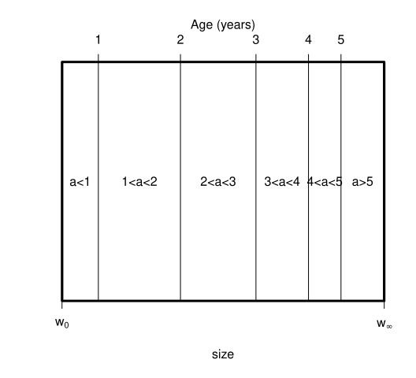
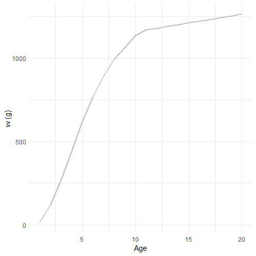
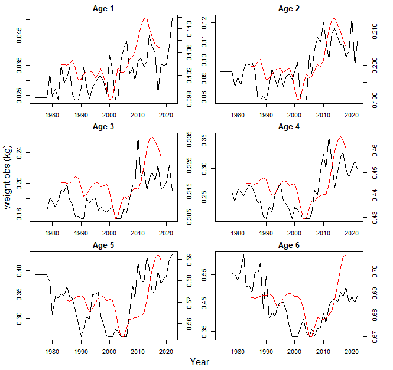
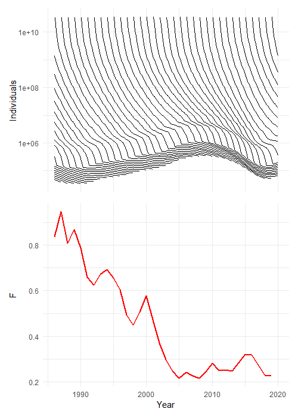
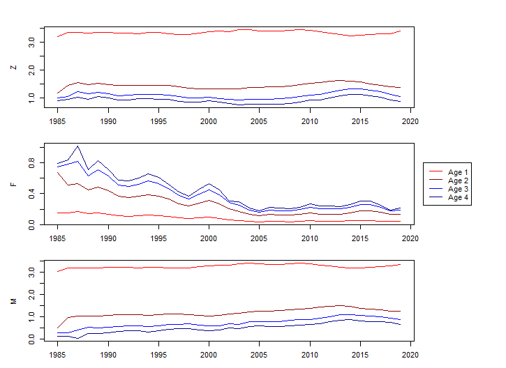
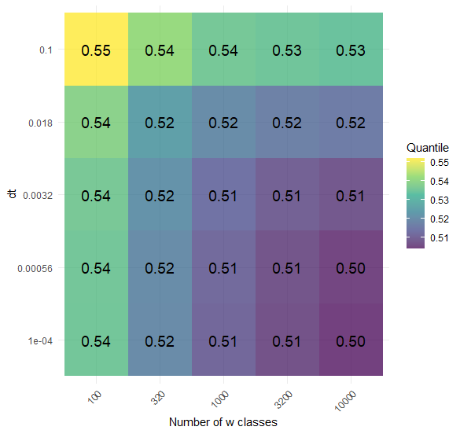
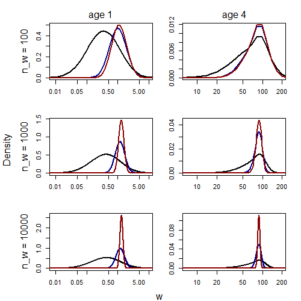

# Introduction

The majority of assessment models for category 1 stocks in the International Council for Exploration of the Seas (ICES) are age based. This is a natural way of thinking about population dynamics as in a closed system, the number of individuals in a cohort, $N$, can only go down as they die. The dynamics of a cohort are
\begin{equation}
    \frac{dN}{dt}=-ZN
    (\#eq:dummy11)
\end{equation}
where $Z=F+M$, with $F$ being the fishing mortality and $M$ being the natural mortality. Fishing mortality and natural mortality can vary in time. 
For an age-based model this has the solution that the numbers at time $t$ in age-class $a$  is
\begin{equation}
    N_{a,t}=N_{a-1,t-1}\exp(-Z_{a-1,t})
    (\#eq:grow)
\end{equation}
for $a=2,\ldots{},A-1$ and $t=1,\ldots$. For the first age-class, the number in the new cohort is the recruits
\begin{equation}
    N_{1,t}=R_{t}\exp(-Z_{0,t})
    (\#eq:dummy)
\end{equation}
for all $t$. Often $Z_{0,t}$ is zero if there are no catches of age-class one in the data.
The final age class, $A$, is a plus group, which means there is no maximum age of a fish,
\begin{equation}
    N_{A,t}=N_{A-1,t-1}\exp(-Z_{A-1,t}) + N_{A,t-1}\exp(-Z_{A,t}),
    (\#eq:plus)
\end{equation}
with $Z_{a,t}=M_{a,t}+F_{a,t}$ for $a=0,\ldots{},A$ and all times.
Note that these are age classes that have the interval one year and not the ages of the fish. Some stocks have the first age class being age 0 (e.g. North Sea whiting), where as other have the first age class being older (e.g. age 3 for North Sea saithe).

Most category 1 assessments are based on equations \@ref(eq:grow)--\@ref(eq:plus), with additional features [e.g., process error in @sam]. The same equations are commonly the basis to give catch advice, calculate reference points (e.g. MSY) and perform management strategy evaluations (MSE).

A lot of data studies are specifically designed to collect data for age-based models. For example, fish that are aged on surveys using a length-stratified design. 
This design is good for finding the age at length, so that fish can be aged just by knowing their length and numbers at age can be calculated. However, the design is not as good at finding length from age, which means that growth curves can be difficult to calculate.

There are also many multispecies models that are age-based [@Trijoulet_19; @Trijoulet_20; @sms]. In some cases, emergent natural mortality from age-based multispecies models are used as inputs to single-species assessments [e.g., @ICES2024].

Despite strong arguments for adopting size-based models over age-based models [@Andersen_book] , we are unaware of any data-rich assessments that use size-based models. This work was motivated by the aim to use the multispecies size spectrum model, mizer [@hartvig; @blanchard; @mizer] as an age-based model to fit with current assessment and MSE frameworks. This will take advantage of the mechanistic dynamics of the mizer model, while keeping to the age-structured frameworks used in ICES.

In this blog we will explain and demonstrate how we calculate emergent age in mizer.


# Calculating age in mizer

Growth is an emergent property of feeding [@Andersen_book] and so is
size-at-age. To calculate the emergent size at age in mizer at time
$t_0$, we introduce an *immortal individual* (II) of species $i$ and
track the size of that individual. At time $t$, the size of the II will
be $I_i(t_0,t)$, with
\begin{equation}
\frac{\partial I_i}{\partial t} \;=\; g_i\bigl(I_i(t_0,t),t\bigr).
(\#eq:IIpde)
\end{equation}
Solving this from $t_0$ to time $T$ with boundary condition
$I_i(t_0, t_0) = w_{0,i}$, we know that an individual of species $i$ and
age $T - t_0$ will be size $I_i(t_0, T)$. In mizer, fish cannot overtake
each other in size, therefore we know that fish smaller than $I_i(T)$ will be
younger, and larger fish will be older. If we introduce such IIs at
annual increments, then we can follow different age classes throughout
the model. Figure \@ref(fig:ageingmizer) demonstrates the process, showing how, for a given species, age is calculated.

```{r ageingmizer, echo=FALSE, out.width="500px",out.height="500px", fig.align='center', fig.cap="Demonstration of how we calculate weights for immortal individuals across time. Each line represents the weight of one II, each introduced annually."}

```

We solve equation \@ref(eq:IIpde) in mizer for time `dt` numerically given weight classes `w`, with differences `dw`. If at the current time the II is size `cur_waa` then it will be in size class

```{r,eval=F}
cur_idx <- max(which(cur_waa >= params@w))
```

and will grow at rate 

```{r,eval=F}
g <- grow[cur_idx]
time_to_end <- (togro - cur_waa) / g # how far is next size class, can i grow it in dt?
```

It will grow at this rate until it reaches the next size class

```{r,eval=F}
togro <- params@w[cur_idx + 1]
```

which will take time

```{r,eval=F}
time_to_end <- (togro - cur_waa) / g
```

Initially the II will grow for time `dt` but will move through weight classes. We monitor how long is left to grow with variable `time_left` intially setting it to `dt`. If `time_to_end<=time_left` then the II's weight will be

```{r,eval=F}
cur_waa <- cur_waa + g * time_left
```

otherwise it will grow to the next size class for `time_to_end` and we update the time remaining

```{r,eval=F}
cur_waa <- cur_waa + g * time_to_end
time_left <- time_left - time_to_end 
```

The process is repeated until `time_to_end<=time_left`.

Figure \@ref(fig:aging-weights) shows the emergent weight at age for whiting in mizer.

```{r aging-weights, echo=FALSE, out.width="500px",out.height="500px", fig.align='center', fig.cap="Emergent growth curve for whiting."}

```

We added the above to the `project` and `project_simple` functions so that it updates the size of the IIs each `dt`. In addition we added a new slot to the `MizerSim` objects so that we can store the weight at age for all ages, time steps and species, `waa`.

```{r, eval=FALSE, include=TRUE}
#the mizerSim object - now with a waa section
setClass( 
    "MizerSim",
    slots = c(
        params = "MizerParams",
        n = "array",
        effort = "array",
        n_pp = "array",
        n_other = "array",
        waa = "array"
    )
)
```

Each year we add a new II, and also remove the oldest II at the same time. We give an argument to `project` to input the initial weights at age (`waa_initial`), a matrix with dimensions number of species and maximum age (defaulted to 20), `nages`. If absent the initial weights at age are calculated from the `getGrowthCurves` function.  

The `project` function will now return a `mizerSim` object with a `waa` slot which contains an `array` with the dimensions `t_max*t_save`, number of species and `nages`.

We demonstrate the weight at age using the North Sea model with fishing mortality from stock assessments (`historicfishingM` see @spence_prec) from 1984 to 2019. We ran the model to the steady state by running it for 100 years using 1984 fishing and then projected it to 2019.

```{r, eval=FALSE, include=TRUE}
#project to steady state - so that we can use the waa generated here as initial_waa
#fishing array is the historicfishingM remade for mizer
tosteady <- project(params, effort = fishing_array[1,],t_max =100, initial_n = params@initial_n)

#projecting, using the values from the end of the steady state run for n, npp and waa
projection <- project(params, effort = fishing_array,  initial_n = (tosteady@n)[(dim(tosteady@n)[1]),,],
                      initial_n_pp = (tosteady@n_pp)[(dim(tosteady@n)[1]),],
                      waa_initial = tosteady@waa[1001,,]) 

```

```{r historic-weights, echo=FALSE, out.width="80%", fig.align='center', fig.cap="The black line shows the weight at age inputs to SMS' key-run [@ICES2024] (and the stock assessent) for whiting and the red line shows the mizer estimate of weight at age for whiting using `NS_params`"}

```

In Figure \@ref(fig:historic-weights) we show the size at age of whiting and compare it to weight at age inputs to SMS' key-run [@ICES2024]. Using the default mizer model `NS_params` we show that the weight at age of whiting changes over the simulation, with a similar pattern to the inputs to SMS, however, the scale and range are different.

## Numbers at age {#sec:numatage}

Given the IIs we can calculate the numbers at age. Suppose that at time $t$ the density of numbers at weight is shown below, with IIs aged one, $I_i(t-1,t)=0.2$, and two, $I_i(t-2,t)=5$, being shown.

```{r,eval=T,echo=F, fig.align='center'}
plot(1,1,type="n",xlim=c(0,3),ylim=c(5^3,5^10),xlab="w(g)",ylab="n",axes=F,log="y")
rect(0,1,0.5,5^9,col="darkred")
rect(0.5,1,1,5^6,col="darkred")
rect(1,1,1.5,5^5,col="darkred")
rect(1.5,1,2,5^4.5,col="darkblue")
rect(2,1,2.5,5^4,col="darkblue")
rect(2.5,1,3,5^3.8,col="grey")
axis(2)
box()
axis(1,at=seq(0,3,0.5),label=c(0.001,5^(-3:2)))
abline(v=2.5,lwd=3,lty=3)
abline(v=1.5,lwd=3,lty=3)
text(x=2.75,y=5^6,labels=expression(l[i](t-2,t)))
text(x=1.75,y=5^6,labels=expression(l[i](t-1,t)))
```

The numbers younger than age one are all of the individuals smaller than $I_i(t-1,t)=0.2$, which in the figure above is 14671.88. The number of individuals younger than two years old are  smaller than $I_i(t-2,t)=5$, which in the figure is 17671.88. Therefore, 14671.88 are in the youngest age class (less than one years old) and 3000 individuals are in the age class between one and two years old.

In this example the IIs were on the boundary of the weight-classes. However, in practice this will almost surely not happen. The IIs will fall between weight-classes, and so, to assign an age to individuals in that weight-class we describe how individuals are distributed within the weight class. The plot below is more likely:

```{r,eval=T,echo=F,fig.align='center'}
plot(1,1,type="n",xlim=c(0,3),ylim=c(5^3,5^10),xlab="w(g)",ylab="n",axes=F,log="y")
rect(0,1,0.5,5^9,col="darkred")
rect(0.5,1,1,5^6,col="darkred")
rect(1,1,1.5,5^5)
rect(1.5,1,2,5^4.5,col="darkblue")
rect(2,1,2.5,5^4)
rect(2.5,1,3,5^3.8,col="grey")
axis(2)
box()
axis(1,at=seq(0,3,0.5),label=c(0.001,5^(-3:2)))
abline(v=2.3,lwd=3,lty=3)
abline(v=1.1,lwd=3,lty=3)
text(x=2.5,y=5^6,labels=expression(l[i](t-2,t)))
text(x=1.3,y=5^6,labels=expression(l[i](t-1,t)))
```

It is clear that the individuals in the red bars are less than one, and the individuals in the blue bar are less than two but older than one, but it is not clear how old the individuals in the white bars are.

Defining how the individuals in the white bars are distributed is down to the user. In this work we defined it as following a power law. Specifically the density of individuals between sizes $w_0$ and $w_1$ was
\begin{equation}
\alpha{}w^{\beta}.
\end{equation}
We set
\begin{equation}
\beta=\frac{\log(n(w_1))-\log(n(w_0))}{\log(w_1)-\log(w_0)},
\end{equation}
and
\begin{equation}
\alpha=\frac{n(w_0)(w_1-w_0)(\beta+1)}{w_1^{\beta+1}-w_0^{\beta+1}},
\end{equation}
which ensures that the total number in the weight-class is constant in both cases.

The example above becomes:

```{r,echo=F,fig.align='center'}
plot(1,1,type="n",xlim=c(0,3),ylim=c(5^3,5^10),xlab="w(g)",ylab="n",axes=F,log="y")
rect(0,1,0.5,5^9,col="darkred")
rect(0.5,1,1,5^6,col="darkred")
rect(1.5,1,2,5^4.5,col="darkblue")
rect(2.5,1,3,5^3.8,col="grey")
axis(2)
axis(1,at=seq(0,3,0.5),label=c(0.001,5^(-3:2)))

text(x=2.5,y=5^6,labels=expression(l[i](t-2,t)))
text(x=1.3,y=5^6,labels=expression(l[i](t-1,t)))

n_a <- 5^4
n_b <- 5^3.8
w_0 <- 5^0
w_1 <- 5^1

beta <- (log(n_b) - log(n_a)) / (log(w_1)-log(w_0))
alpha <- n_a * (w_1-w_0) * (beta + 1) / (w_1 ^ (beta + 1) - w_0^(beta + 1))

polygon(x=c(2,2,2.3,2.3),y=c(1,alpha * w_0 ^ beta,alpha * (5 ^(2 * 2.3 - 4))^ beta,1),col = "darkred",border = F)
polygon(x=c(2.3,2.3,2.5,2.5),y=c(1,alpha * (5 ^(2 * 2.3 - 4)) ^ beta,alpha * (w_1)^ beta,1),col = "grey",border = F)
polygon(x=c(2,2,2.5,2.5),y=c(1,alpha * w_0 ^ beta,alpha * w_1 ^ beta,1))
abline(v=2.3,lwd=3,lty=3)

####
n_a <- 5^5
n_b <- 5^4.5
w_0 <- 0.04
w_1 <- 0.2

beta <- (log(n_b) - log(n_a)) / (log(w_1)-log(w_0))
alpha <- n_a * (w_1-w_0) * (beta + 1) / (w_1 ^ (beta + 1) - w_0^(beta + 1))

polygon(x=c(1,1,1.1,1.1),y=c(1,alpha * w_0 ^ beta,alpha * (5 ^(2 * 1.1 - 4))^ beta,1),col = "darkred",border = F)
polygon(x=c(1.1,1.1,1.5,1.5),y=c(1,alpha * (5 ^(2 * 1.1 - 4)) ^ beta,alpha * (w_1)^ beta,1),col = "darkblue",border = F)
polygon(x=c(1,1,1.5,1.5),y=c(1,alpha * w_0 ^ beta,alpha * w_1 ^ beta,1))
abline(v=1.1,lwd=3,lty=3)
box()

```

```{r cohort-plot, echo=FALSE, out.width="500px", out.height="700px", fig.align='center', fig.cap="The top plot shows the evolution of individual whiting cohorts through time. The lower plots shows the fishing mortality over time for whiting from @spence_prec"}

```


## Mortality rates{#sec:Zatage}


By calculating the numbers at age, as done in Section \@ref(sec:numatage), we can calculate how many individuals die in a cohort in a year. Consider that at time $t-1$ and $t$ we have calculated numbers age $a-1$ and $a$ respectively, then we can rearrange equation \@ref(eq:grow) to find
\begin{equation}
    Z_{a-1,t-1}=-\ln(N_{a,t})+\ln(N_{a-1,t-1}).
    (\#eq:getZ)
\end{equation}
This is the total mortality for age $a-1$ at time $t-1$. By calculating the numbers caught at age $a$ in time $t-1$, $C_{a-1,t-1}$, in a similar way to how we calculate the numbers at age, we can  calculate the fishing mortality
\begin{equation}
    F_{a-1,t-1}=\frac{Z_{a-1,t-1}C_{a-1,t-1}}{N_{a-1,t-1}(1-\exp(-Z_{a-1,t-1}))}
    (\#eq:getF)
\end{equation}
and the natural mortality
\begin{equation}
    M_{a-1,t-1}=Z_{a-1,t-1}-F_{a-1,t-1}.
    (\#eq:getM)
\end{equation}


After a simulation we get the numbers at age and the numbers caught at age

```{r, eval=FALSE, include=TRUE}
numbers <- get_num_by_year_by_age(sim)
catch <- get_catch_by_year_by_age(sim)
```

The `get_catch_by_year_by_age` function works the same as `get_num_by_year_by_age`, but prior to the numbers in size classes being summed over ages, they are multiplied by the size, species specific fishing mortality, acquired from `getFMort`. The catch here is the same as in mizer's `getYield`.

We calculate equations \@ref(eq:getZ) and \@ref(eq:getF) for the `i`th year, `j`th species and `k`th age class to get $Z_{i,k}$ and $F_{i,k}$

```{r, eval=FALSE, include=TRUE}
z <- -log(numbers[i+1,j,k+1]) + log(numbers[i,j,k])
F_m <- catch[i-1,j,k]*z)/(numbers[i,j,k]-next_alive) ### F_m rather than F as F is protected
```

and equation \@ref(eq:getM) to get $M_{i,k}$

```{r,eval=FALSE}  
m <- z - F_m
```

Figure \@ref(fig:Z-plot) is the emergent $Z$, $F$ and $M$ over time using the historical fishing mortality.

```{r Z-plot, echo=FALSE, out.width="80%", fig.align='center', fig.cap="Plots depict the $Z$, $F$ and $M$ rates for whiting of different ages over time"}

```

# Sensitivity to `no_w` and `dt` {#sec:Sens}

Due to the numerical integration of the partial differential equation (pde) in mizer, the II do not follow the distribution of fish density exactly and this sometimes results in negative $M$. To investigate this we followed one individual and their growth for different values of `dt` and `no_w`. We initialised the `params` object for `no_w` equal to 100, 1000 and 10000

```{r,eval=F}
params <- newMultispeciesParams(NS_params@species_params, no_w = no_w)
allgrow <- getEGrowth(params)
gs <- allgrow[6,]
```

and assumed a constant growth rate `gs` for a whiting individual. We initialised the population at zero except in the first size class where we set it so that there was only one individual.

```{r,eval=F}
num <- rep(0,length(params@w))
num[1] <- 1 / params@dw[1]
```

Assuming no mortality and no recruitment we updated the numbers at size for 10 years using the numerical pde solver in mizer (see supplementary for the code) and compared the size distribution with the size of an II at the same age.

```{r quantiles, echo=FALSE, out.width="500px",out.height="500px", fig.align='center', fig.cap="Comparison of II size prediction to mizer's numerical solution. The grid cell value is the proportion of individuals in the numerical solution that are smaller than the II. Each simulation has a different `dt` and `no_w`."}

```

```{r sensitive, echo=FALSE, out.width="600px",out.height="600px",  fig.align='center', fig.cap="The numerical solution of the growth with different `dt` and `no_w`. Each plot contains 3 lines, indicating a different value of `dt` - black is 0.1, blue is 0.01 and red is 0.001. Each row of plots indicates that the example's `no_w`, increasing from top to bottom. The left columns shows age 1 and right age 4."}

```

We compared the proportion of individuals that are smaller than the II and found that as `dt` got smaller and `no_w` got bigger the proportion approached 50%, Figure \@ref(fig:quantiles). Further, as `dt` got smaller and `no_w`got bigger the range of sizes at age decreased Figure \@ref(fig:sensitive).

Therefore for more accurate age-based information we are required to choose a finer resolution for the numerical solver in mizer. We demonstrate this on the North Sea model for values of `dt` equal to 0.1, 0.01 and 0.001, and `no_w` equal to 100, 1000 and 2000.

```{r, echo=FALSE, results='asis'}
library(knitr)
neg_Ms <- matrix(c(0.10158730, 0.009920635, 0.002380952,
                    0.07460317, 0.000000000, 0.000000000,
                    0.07261905, 0.000000000, NA), nrow = 3, byrow = TRUE)
colnames(neg_Ms) <- c("100", "1000", "2000")
rownames(neg_Ms) <- c("0.1", "0.01", "0.001")
kable(neg_Ms, caption = "Proportion of Negative Ms in ages 1 to 6 for all species. The rows represent different `dt`s and the columns different `no_w`. We did not run it for `dt=0.001` and `no_w=2000` as the file was too large.", row.names = TRUE)

```

Decreasing `dt` and increasing `no_w` makes the numerial integration more accurate and stablises the results. This comes at a cost, as the `MizerSim` object gets very large.

# Discussion

Most models used in advice are age-based. In this blog post, we have introduced a way of calculating emergent age in mizer, potentially increasing the utility of mizer when it comes to giving management advice.

For example, mizer could be used as an operating model for MSEs. A common MSE framework is to use an operating model to test management actions. The operating model stands in for reality and management actions, such as harvest control rules, are run [@punt_MSE]. This process involves the operating model generating data, which assessment models are fitted to. As data for assessment models is age resolved, the operating model has to be able to sample age resolved data. By introducing emergent age in mizer, mizer can now generate age-based data, meaning that it can be used as an operating model in the MSE frameworks.

Some category 1 assessments, those that have full analytical assessments, use natural mortality at age from fitted multispecies models as inputs to the assessment. For example, many North Sea stocks use natural mortality estimates from the stochastic multispecies model [@sms]. Typically, assessment models require natural mortality at age rather than size. In Section \@ref(sec:Zatage) we showed that we can calculate emergent natural mortality at age. Therefore, coupled with dynamical fitting, [@spence_cs], mizer could be used to provide natural mortality estimates as inputs to single-species assessments.

Many data collection schemes are designed to be fit to age-based models, for example, length stratified sample is used on surveys to calculate age-length keys. For these reasons, it can be difficult to incorporate age-based data when calibrating mizer. Furthermore, the data collected are not in a steady state (e.g., see Figure \@ref(fig:historic-weights)). Using the ages process described here, we can compare these data with mizer. For example, growth could be tuned by looking at emergent growth rates rather than steady states.

In many cases, fishing mortality from stock assessments has been used to drive the dynamics of the mizer model [@blanchard; @spence_ns; @spence_prec]. Typically fishing mortality from stock assessments is age-based. In previous studies, the fishing mortality inputs were some kind of average, for example Fbar, or some steady-state assumption about age [@spence_prec]. Using this approach, age-based fishing mortality can be implemented in age classes as they change size throughout the simulation as done in the assessment. However, how selectivity occurs within an age can be difficult to calculate [@spence_prec], particularly at lower ages.

The work presented here is exact in the limit when `dt` and `dw` are 0, however practically this is not possible. We showed that as `dt` and `dw` get smaller the age estimation becomes more accurate, however, inaccuracies in the ageing process can lead to some strange behaviour. For example, we found that for the default values of `dt` and `dw` some cohorts natural mortality was less than 0, i.e. $M<0$, which could cause difficulties when comparing mizer to age-based models. This could be caused by the numerical integration and/or how we say the lengths of fish within an age class are distributed. More research is required, although we suspect these problems occur due to how the emergent catch is calculated.

In this blog post, we introduced an extension that allows you to calculate dynamic growth curves and ages at size in mizer. This addition will improve how mizer is calibrated to data and also allows it to be interpreted and compared to age-based models, potentially increasing the utility of mizer in the assessment and advice process.

