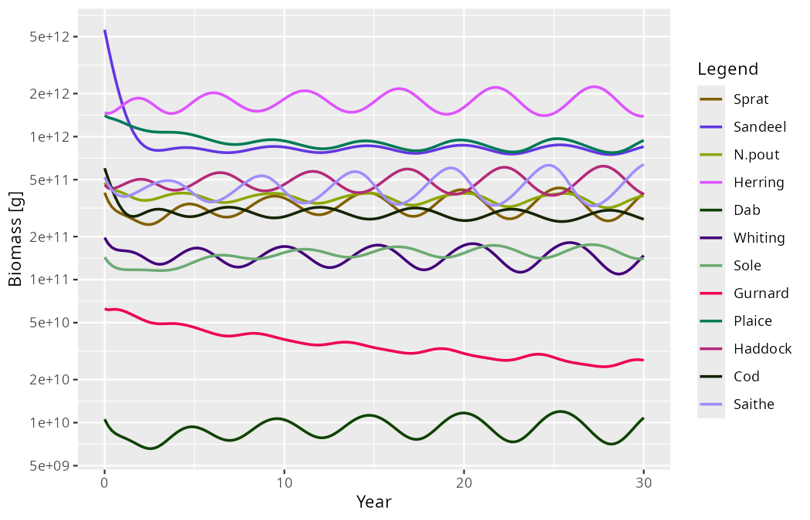
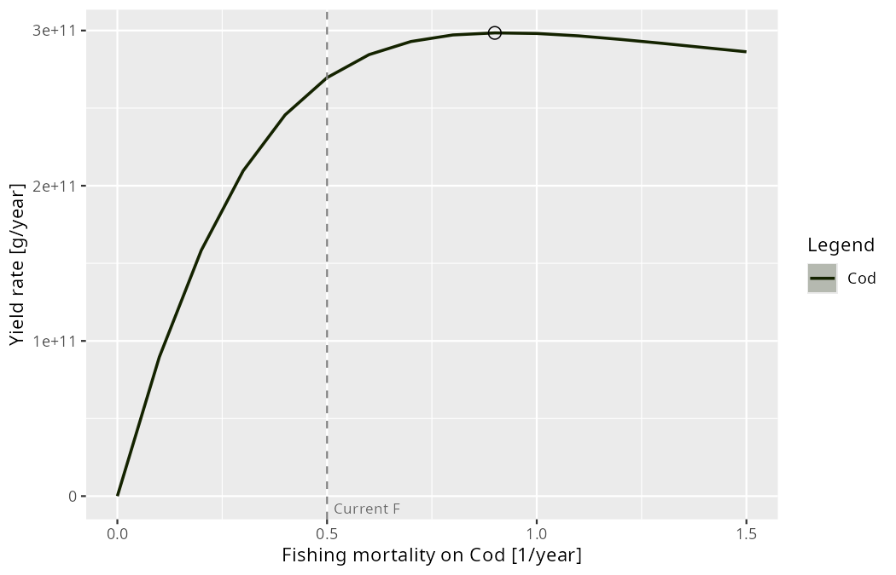
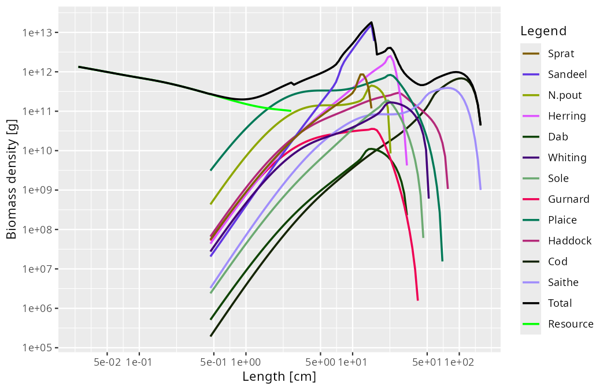

```{r setup, include=FALSE}
knitr::opts_chunk$set(echo = TRUE, eval = FALSE)
```

Where mizer 3.2 was a quick corrective release, 3.3 adds capability. But start with the change you will notice first: **the two functions that put a model onto a steady state have been renamed after what each of them keeps fixed.** `steady()` is now `tuneSteadyState()` and `projectToSteady()` is now `findSteadyState()`. The old names keep working exactly as before, without a warning, so nothing you have written breaks.

Three themes then run through the release.

The first is a question mizer could not previously answer about itself: **is this model at its steady state?** Every calibration workflow depends on the answer, and until now you had to keep track of it in your head.

The second is what to do when the steady state is **dynamically unstable** — when the model does not settle down but oscillates. mizer can now find such a steady state anyway, tell you that it is unstable, predict the period of the oscillation you should expect, and detect the limit cycle when you project the dynamics.

The third is **scanning**: running a model over a range of values of anything and measuring anything on whatever attractor it settles on. That gives yield-against-fishing-mortality curves with $F_{MSY}$ marked, bifurcation diagrams, and scans over any species or resource parameter, all from one function.

Alongside these, the documentation has been reorganised: the topic articles and the AI-agent skills are now literally the same files, so there is one **guide** per stage of the modelling workflow and an agent working in your project reads exactly what you read.

## Two finders, named after what they keep fixed

Most mizer scripts begin by putting a model onto a steady state, and until now the two functions that do it were called `steady()` and `projectToSteady()`. Neither name said what distinguished them, and `projectToSteady()` returned a `MizerParams` or a `MizerSim` depending on an argument. Each is now named after what it holds fixed:

- **`tuneSteadyState()`** (was `steady()`) holds the reproduction rate and the resource abundance at the values you supplied and afterwards adjusts the parameters that generate them — `erepro`/`R_max` and `cc_pp` — so that those held values are steady too. That is the calibration job: you have decided what the model should look like, and this makes that state a fixed point.

- **`findSteadyState()`** (was `projectToSteady()`) changes no parameter at all. Reproduction, the resource and the consumer spectra settle together at whatever the parameters you already have imply. Use it to ask what state a given model settles into — under a changed fishing effort, for instance.

- **`projectUntilSettled()`** is the one to call when you want to watch the approach rather than only its endpoint. It is `findSteadyState()` with the trajectory kept, and it always returns a `MizerSim`. It replaces `projectToSteady(return_sim = TRUE)`; `return_sim` is gone from the two finders, which always return a `MizerParams`.

Nothing breaks. `steady()` and `projectToSteady()` remain as thin wrappers that reproduce the old behaviour exactly, `return_sim` included. They do not warn and they are not going away, so existing scripts and teaching material keep running. New code should use the new names.

Both finders take the same new `solver` argument, which is what makes an unstable steady state reachable at all — two sections down. First, the question that comes before either function.

## Is your model at its steady state?

Almost every mizer workflow assumes the model is sitting at a fixed point. Calibration steps move it off; `tuneSteadyState()` puts it back. Forgetting a `tuneSteadyState()` call after a `match…()` step is the most common way a calibration goes quietly wrong, because nothing in the model's printout used to reveal it.

Three new things fix that. `isSteady()` answers the question directly:

``` r
isSteady(NS_params)
#> [1] TRUE
```

`summary()` on a `MizerParams` object now reports the model's biomass drift along with everything else it shows:

```         
Steady state:
    biomass drift:  0.014 /year (at steady state)
```

And the matching functions now say when they have moved the model:

``` r
params <- matchGrowth(NS_params)
#> `matchGrowth()` has rescaled the model and so moved it off its steady state.
#> Run `tuneSteadyState()` to settle it again. You can check with
#> `getSteadyResidual()`.
```

The same `summary()` on that model now reads

```         
Steady state:
    biomass drift:  4.6 /year   (not at steady state, largest in N.pout - run tuneSteadyState())
```

The `calibrate…()` functions and `scaleModel()` deliberately stay quiet, because an overall scaling factor is an exact symmetry of the model and leaves the steady state untouched.

When the answer is "no", `getSteadyResidual()` tells you *where*. For each size class it returns that class's contribution to the relative rate of change of its species' biomass, in 1/year, so zero everywhere means the model is on a fixed point — and the contributions add up over sizes to the very number the `summary()` line reports:

``` r
plot(getSteadyResidual(params))

rowSums(getSteadyResidual(params))["N.pout"]
#>    N.pout
#> -4.580819
```


The array therefore says *where* a model is unsteady in the same currency mizer uses to decide *whether* it is. Every species is losing biomass, N.pout fastest at 4.6 times its own biomass a year, and the losses sit where the biomass actually is: a broad trough around half a gram, deepest for N.pout, and a sharper one just above maturity, deepest for Herring at about 120 g. `matchGrowth()` has rescaled the growth rates, and every spectrum is now emptying faster than recruitment fills it. For the consumers the value is exact rather than a finite difference — the backward-Euler transport coefficients that `project()` uses satisfy $AN - S = -\Delta t\, dN/dt$ identically — and everything is evaluated with the model's own reproduction function and its own resource dynamics, so it works whatever those are.

Weighting by biomass is what lets the array cover every size class without a threshold: a class holding a trace contributes a trace. The scale-free reading is still there under `measure = "per_capita"`, which returns `(dN/dt)/N` — useful when you want to see a size class whose growth and mortality are out of balance even where it holds almost no fish, at the price of extremes that belong to the emptiest cells.

If you would rather be warned than have to remember to ask, `project()` gains an experimental `check_steady` argument that warns when it is handed a model that is not settled.

## Steady states you cannot reach by projecting

By default both finders run the dynamics until they stop changing. That only works if the steady state is *stable*. Push a model hard enough — with fishing, usually — and it crosses a Hopf bifurcation: the steady state still exists, but every trajectory spirals away from it, and a solver that projects has nothing to converge to.

That is what the new `solver` argument is for. With `solver = "newton"` the steady-state equation is solved directly with a Newton-type root finder (from the `nleqslv` package) rather than by projecting, so it finds the steady state regardless of its stability, and it discovers the support of the steady state on its own. Take the North Sea model and raise every gear's effort to 1.5:

``` r
params_f15 <- findSteadyState(NS_params, solver = "newton", effort = 1.5)
```

`findSteadyState()` carries the resource densities among its unknowns, so `solver = "newton"` there needs the default semichemostat resource dynamics; `tuneSteadyState()` holds the resource fixed and so takes the Newton solver whatever the resource dynamics are.

Is that state stable? mizer discretises the size axis but leaves time continuous, so on the size grid the model is a system of ordinary differential equations $dN/dt = F(N)$, and a steady state is a state at which $F$ vanishes. `getStability()` differentiates $F$ at that point and returns the eigenvalues of the resulting Jacobian:

``` r
stab <- getStability(params_f15, effort = 1.5)
stab$stable
#> [1] FALSE
stab$max_real_part
#> [1] 0.07095636
stab$eigenvalues[1]
#> [1] 0.07095636+1.273383i
stab$dominant_period
#> [1] 4.934245
```

The leading eigenvalue is complex with a positive real part. A real positive eigenvalue would mean monotone growth away from the steady state; a complex pair means the perturbation grows *while oscillating* — here by a factor of $e$ every fourteen years or so — and the imaginary part sets the period, about 4.9 years. Fish and resource are perturbed together, so this rests on nothing but the model.

**No time step enters that calculation.** The eigenvalues are a property of the model rather than of a solver, and they are what a simulation converges to as you refine its step. That is worth dwelling on, because there is a second and quite different question one can ask: not whether the *model* is stable, but whether *mizer's numerical step* is. `getDiscreteStability()` answers that one. It linearises the one-step map $N(t + \Delta t) = G(N(t))$ that `project(method = "euler")` takes at a given `dt` and reports its spectral radius $\max_i|\mu_i|$, which is below 1 exactly when the scheme does not amplify a perturbation:

``` r
getDiscreteStability(params_f15, effort = 1.5, dt = 0.1)$spectral_radius
#> [1] 0.9994869
```

Below one: a perturbation that grows in the model *shrinks* in a simulation stepped at `dt = 0.1`. That is not an abstract worry. Nudge the fixed point by 5% and run the same projection twice, changing nothing but the method:

``` r
params_nudged <- params_f15
initialN(params_nudged) <- initialN(params_f15) * 1.05

projectUntilSettled(params_nudged, effort = 1.5, t_max = 200, t_save = 0.2,
                    method = "euler")
#> Settled onto a limit cycle of period 4.9 years (relative amplitude 0.031)
#> after 21 years.

projectUntilSettled(params_nudged, effort = 1.5, t_max = 200, t_save = 0.2,
                    method = "tr_bdf2")
#> Settled onto a limit cycle of period 5.2 years (relative amplitude 0.63)
#> after 61.5 years.
```

Same model, same starting state, same fishing, and the two runs disagree by a factor of twenty. The default step leaves the 5% nudge almost exactly where it found it, circling at 3% of the mean; stepped with `tr_bdf2` the same perturbation spirals out to a cycle swinging by 63%. Expressed as a growth rate, the euler step turns the model's $+0.071$ per year into $-0.005$ per year: mizer solves the transport implicitly, and implicit schemes damp oscillations artificially, so the step contributes about $0.076$ per year of damping of its own — just enough to swamp the instability and reverse its sign. Nor does the discrepancy shrink tidily as the step coarsens: at $\Delta t = 1$ the step is unstable again, with a spectral radius of 1.11, but it oscillates with a 3.4-year period belonging to no mode of the model. That is why the run below uses `method = "tr_bdf2"`, and why `getStability()` differentiates the model's rates of change rather than going anywhere near the one-step map. Where a run starts matters as well: begun from `NS_params` instead of from the nudged fixed point, the default step settles on a cycle a quarter the size of the true one rather than a twentieth of it. The [*Dynamic stability and Hopf bifurcations*](https://sizespectrum.org/mizer/articles/dynamic_stability.html) article works both cases through.

Now project the dynamics and watch the prediction come true. `projectUntilSettled()` recognises that it is not converging to a fixed point and reports what it did settle on:

``` r
sim <- projectUntilSettled(NS_params, effort = 1.5, t_max = 200, t_save = 0.2,
                           method = "tr_bdf2")
#> Settled onto a limit cycle of period 5.4 years (relative amplitude 0.67)
#> after 30 years.
plotBiomass(sim)
```



The nature of the attractor is recorded in a `"convergence"` attribute on the result, so code can branch on it:

``` r
attr(sim, "convergence")$attractor
#> [1] "limit_cycle"
attr(sim, "convergence")$period
#> [1] 5.4

attr(findSteadyState(NS_params, t_max = 100), "convergence")$attractor
#> [1] "fixed_point"
```

The attribute separates three things that used to be conflated: `termination` says why the run stopped, `converged` whether the solver met its own criterion, and `attractor` what the state reached actually is. Only the last is a claim about the model, and it is made from the biomass drift — a `residual` the attribute also carries — rather than from the distance function having gone quiet.

The detected period of 5.4 years is within ten percent of the 4.93 years the linear analysis predicted, even though the cycle we are looking at is anything but small: its relative amplitude is 67% of the mean. The linear prediction is a statement about infinitesimal perturbations of the steady state, so that remaining gap is what the nonlinearity does to the shape of a large-amplitude cycle; closer to the bifurcation the two agree more closely still. To see the *shape* of the oscillation without the growth and the nonlinear distortion, `getOscillationModeSim()` builds an ordinary `MizerSim` covering one period of the linearised cycle from the leading eigenvector, which you can then hand to any mizer plotting function.

There is one caveat, and it is important enough that 3.3 ships an article about it. All of this rests on the rates being differentiable functions of the abundances at the steady state. If you have registered a custom rate function with `setRateFunction()` that jumps as a function of the abundances, `solver = "newton"` may stall and `getStability()` can return a plausible-looking number describing neither branch. Re-running with a different finite-difference step `h` is the cheapest check that a model is smooth enough for the analysis to mean anything: if the answer moves, do not trust it. The new [*Discontinuous rate functions*](https://sizespectrum.org/mizer/articles/discontinuous_rates.html) article explains why, and how to give the switch a finite width instead.

## Scanning a model

A yield-against-fishing-mortality curve, a bifurcation diagram over effort, and a scan over the resource carrying capacity are all the same computation: vary something, let the model settle, measure something. mizer 3.3 makes that one function, `scanModel()`. You say what to vary by passing a function that changes the model, and what to measure by passing a function that computes a quantity from a `MizerSim` — and all of mizer's summary functions (`getBiomass()`, `getYield()`, `getSSB()`, `getN()`, `sizeIntegral()`) work as the measuring function unchanged.

The reason this belongs in the same release as the stability tools is that measuring a quantity on an attractor is only well defined once you know what the attractor *is*. On a fixed point, `scanModel()` reads the value straight off the settled state with no further projection at all. On a limit cycle it projects for **exactly one period** of the detected cycle and averages over it, which is the long-term average; a window that is not a whole number of periods leaves a residue of the oscillation in the average and shows up as a jagged curve. When the model settles on neither, the quantity is averaged over `t_sample` years and the affected scan values are named in a message, because those points should not be relied on.

`plotYieldVsF()` has moved into mizer from mizerExperimental, rebuilt as a thin wrapper over `scanModel()`. It varies the fishing mortality on one species, leaving the fishing on every other species alone, marks the mortality at which the yield is largest — which is $F_{MSY}$ — and draws the species' current fishing mortality as a reference line beside it:

``` r
plotYieldVsF(NS_params, species = "Cod")
```



The scan behind the plot is a `MizerScan` object, a data frame carrying the axis labels, the model it started from and the location of each series' maximum:

``` r
scan <- plotYieldVsF(NS_params, species = "Cod", return_data = TRUE)
summary(scan)
#> Yield rate [g/year] vs Fishing mortality on Cod [1/year]
#> 16 scan values from 0 to 1.5
#>
#>  Species Min          Max at_max
#>      Cod   0 298473714340    0.9
#>
#> `at_max` is the scanned value with the largest value, over the
#> values that were scanned. Scan a finer grid to sharpen it.
#>
#> Attractors reached:
#>
#> fixed_point
#>          16
```

`scanEffort()`, `scanFishingMortality()` and `scanSpeciesParam()` build the function that applies each scan value; any function of `(params, value)` returning a `MizerParams` will do, as long as it is idempotent.

## Plots that know what they are showing

Mizer arrays now state what kind of quantity they hold — a value, a density, or a proportion — and two useful things follow.

A density is multiplied by the appropriate Jacobian when plotted against a length axis and has its units restated from `1/g` to `1/cm`, instead of mizer guessing from the array's name. A proportion — the feeding level, `maturity()`, `repro_prop()`, `resource_level()` — is plotted on a linear axis showing the whole of the interval from 0 to 1, widened where the data need it, so the value can be read against the scale it belongs to.

Length-based plots gained two things they had been silently dropping. The resource now appears on them, because `resource_params()` carries weight-length parameters (defaulting to the equivalent spherical diameter of an organism with the density of water, the convention plankton ecology uses). And the total is shown, summed *after* the conversion — at equal length rather than at equal weight, since each species converts weight to length with its own allometry:

``` r
plotSpectra(NS_params, size_axis = "l", power = 2, total = TRUE)
```



Finally, `plotSpectra()` and friends let you choose the plotted quantity with two independent arguments instead of the single `power`: `biomass` selects a biomass rather than a number density, and the new `per_log_size` selects a density with respect to logarithmic size. The power of the weight is the sum of the two, which is why `power = 1` was ambiguous — it is both the biomass density and the number density in log size, and mizer had to guess which you meant when labelling the axis. `power` keeps working, so nothing you have written breaks.

## One guide per stage — and the skills behind them

mizer's topic articles and its AI-agent skills used to be two sets of documents covering the same ground, which is exactly the arrangement in which two documents drift apart. They are now one. Each `inst/skills/<topic>/SKILL.md` is shipped as an agent skill *and* is the source of the matching `guide-*` article on the website. Editing one edits the other.

They are no longer called cheatsheets, either. A cheatsheet reminds you of something you already know; these assume no prior knowledge. So there is now one **guide** per stage of the modelling workflow:

| Stage | Guide |
|----|----|
| Build a model | [Building a mizer model](https://sizespectrum.org/mizer/articles/guide-build-model.html) |
| Settle and calibrate it | [Reaching steady state and calibrating](https://sizespectrum.org/mizer/articles/guide-calibrate-model.html) |
| Change its parameters | [Changing model parameters](https://sizespectrum.org/mizer/articles/guide-change-parameters.html) |
| Set up fishing | [Setting up fishing](https://sizespectrum.org/mizer/articles/guide-set-up-fishing.html) |
| Run simulations | [Running a mizer simulation](https://sizespectrum.org/mizer/articles/guide-run-simulation.html) |
| Analyse and plot | [Analysing and plotting mizer results](https://sizespectrum.org/mizer/articles/guide-analyse-and-plot.html) |
| Analyse stability | [Analysing dynamic stability](https://sizespectrum.org/mizer/articles/guide-analyse-stability.html) |
| Understand the dynamics | [Understanding size-spectrum dynamics](https://sizespectrum.org/mizer/articles/guide-understand-size-spectrum-dynamics.html) |
| Extend mizer | [Extending mizer](https://sizespectrum.org/mizer/articles/guide-extend-mizer.html) |
| Package an extension | [Creating a mizer extension package](https://sizespectrum.org/mizer/articles/guide-create-extension-package.html) |
| Use someone else's extension | [Using mizer extension packages](https://sizespectrum.org/mizer/articles/guide-use-extension-packages.html) |
| Fix code after an upgrade | [Upgrading mizer](https://sizespectrum.org/mizer/articles/upgrading.html) |

Four of these are new. *Running a mizer simulation* and *Extending mizer* previously had a skill but no article. *Understanding size-spectrum dynamics* is new on both sides and is the one to read if you want to know how mizer models *behave* rather than which function to call: which quantities you impose and which the model produces for itself, the feedback loops that couple species, what sets the slope of the steady-state spectrum, and a table mapping a symptom you actually see — a species that collapses, oscillates, stops growing before `w_mat`, or refuses to respond to fishing — to what to inspect. *Analysing dynamic stability* covers the tools described above.

Every old address redirects, but `vignette("cheatsheet-fishing")` does not; the [*Upgrading mizer*](https://sizespectrum.org/mizer/articles/upgrading.html) article has the full table of old and new names.

### Your agent reads the same text

If you use an AI coding agent — Claude Code, Gemini CLI, Codex — the [**mizerAgents**](https://sizespectrum.github.io/mizerAgents/) package installs these skills into your project:

``` r
pak::pak("sizespectrum/mizerAgents")
mizerAgents::setup_mizer_agent()
```

The important change is *where they come from*. `setup_mizer_agent()` now reads the skills from the mizer you have installed, via `system.file("skills", package = "mizer")`, rather than carrying its own copies. So an agent's guidance describes the version of mizer your project actually runs — including, in 3.3, the API index it greps for function names. When you upgrade mizer, your agent's knowledge upgrades with it, with no release of mizerAgents needed.

The *Upgrading mizer* article is shipped as a skill too. Vignettes are not installed with a package, so an agent helping you fix a script that broke after an upgrade previously had no access to that information and would debug a deliberate, documented change from first principles. The skill carries a symptom index — an "unused argument" error, a deprecation warning, a plot that changed, an `identical()` comparison that now fails — mapping each to the release that caused it and the fix.

Skills are refreshed file by file, and each has a `NOTES.md` that the package never touches, where an agent records what it learns about *your* model. Commit it, and your collaborators' agents inherit it.

## Also in 3.3

- **`sizeIntegral()`** calculates any integral $\int N_i(w) K_i(w)\,dw$ over the size spectrum, and is now the recommended way to write your own summary or indicator function: it selects the size range, applies the quadrature scheme the model is actually on, and wraps the result in the right array class. `getBiomass()`, `getN()`, `getSSB()`, `getYield()`, `getYieldGear()` and `getProportionOfLargeFish()` are all implemented with it.

- **One name per accessor.** Seventeen accessors that return a value stored in the `MizerParams` object had two names doing exactly the same thing. The `get`-prefixed name is now superseded in favour of the bare name — the one that also has a replacement function: `getMetabolicRate()` → `metab()`, `getExtMort()` → `ext_mort()`, `getInteraction()` → `interaction_matrix()`, and so on. The `get` prefix is now reserved for functions that *calculate* something from the current state, like `getEncounter()`. The old names are kept as plain aliases that do not warn and will not be removed.

- **One switch for everything mizer tells you.** Nearly every message and warning mizer gives while building or changing a model now goes through a single mechanism, collected into one report rather than a stream, and controlled by `info_level` — or by the new `mizer_info_level` option, which quietens mizer as a whole including the functions that have no `info_level` argument of their own. The mechanism is exported, so an extension package can report through the same channel and obey the same switch.

- **A frozen array no longer swallows your changes silently.** If you set a rate array by hand and then change a species or resource parameter that feeds it, mizer now warns that the change has no effect, names the parameters that were ignored and the quantity holding them back, and tells you the call that hands control back — for example `setMetabolicRate(params, reset = TRUE)`.

- **`validParams()` is about 15 times faster** on an object that is already valid, recognised by a fingerprint of the slots the validation actually depends on. The fingerprint is recalculated on every call and never stored, so it cannot go stale.

- **`knife_edge_length()`** applies a knife-edge selectivity cut at a given length rather than a weight.

- **Quadrature fixes.** `getDiet(proportion = FALSE)` and `getTrophicLevel()` were applying a bin quadrature twice under `second_order_w()`; the calibration and matching functions and `plotYieldObservedVsModel()` had each hand-rolled their size integral and stayed on the first-order scheme. Results on the default scheme are unchanged.

For the complete list see the [changelog](https://sizespectrum.org/mizer/news/index.html).

## Upgrading

``` r
install.packages("mizer")
```

Existing `MizerParams` and `MizerSim` objects are upgraded automatically when you load them with `readParams()` or `readSim()`. Anything that may affect scripts you have already written is described in the [*Upgrading mizer*](https://sizespectrum.org/mizer/articles/upgrading.html) article — and, if you work with an agent, in the skill built from it.

As always, we welcome bug reports and feature requests on [GitHub](https://github.com/sizespectrum/mizer/issues).
