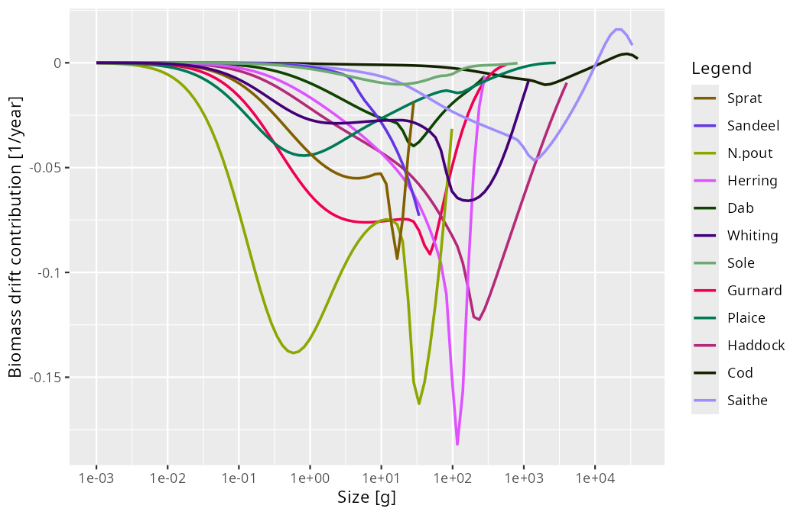
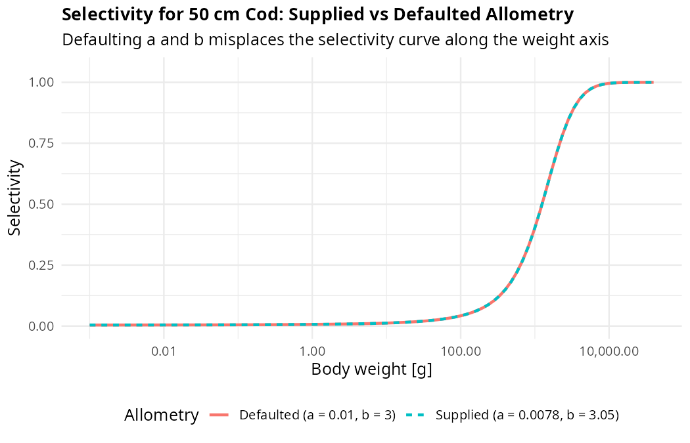
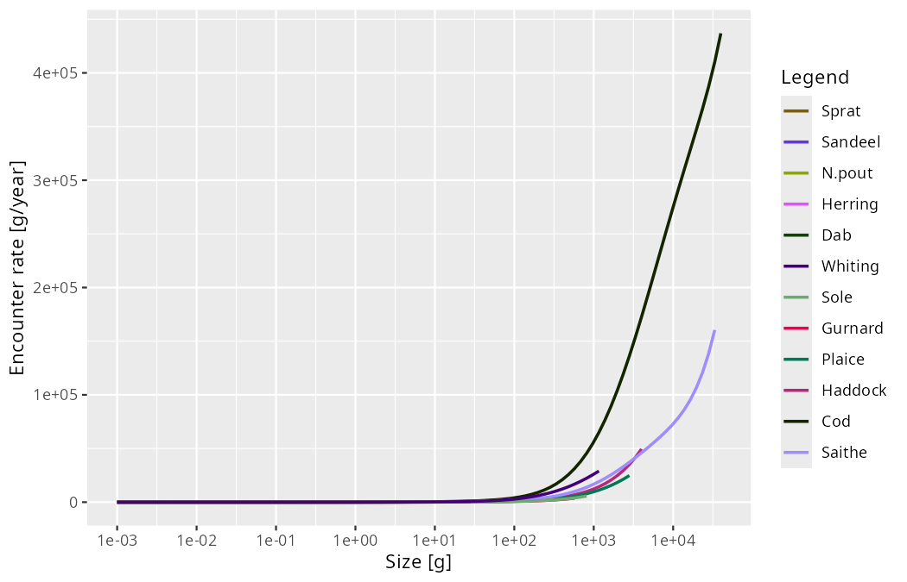

```{r setup, include=FALSE}
knitr::opts_chunk$set(echo = TRUE, eval = FALSE)
```

Recent releases of mizer have been driven by a single unifying theme: making mizer's behaviour **more uniform, more consistent, and more predictable**. 

In mizer 3.1 we introduced second-order numerical accuracy in size and L-stable time steppers. In mizer 3.2 we resolved confusing setter behaviour and made resource setting behave identically to species parameter setting. In mizer 3.3 we renamed the steady-state finders after what each keeps fixed, introduced dynamic stability analysis and model scanning, and unified the AI agent skills with the user guides.

**mizer 3.4** continues this work. It cleans up the foundational data structures by transitioning `MizerParams` and `MizerSim` from S4 to transparent S3 lists, introduces `reconcileSpeciesParams()` to protect species parameters from being silently overwritten, aligns the size-resolved steady-state residual with the model's actual biomass drift, and refines extension hooks and parameter defaults throughout the package.

## No more silent overwrites: reconciling species parameters

When you build or modify a mizer model, mizer maintains two views of your species parameters:

- **`given_species_params(params)`**: the parameters you explicitly supplied (or function argument defaults).
- **`species_params(params)`**: the complete table containing your given values with mizer's calculated or defaulted values filling in the gaps.

In earlier versions, it was all too easy for these two tables to drift out of step. If code modified the parameter table directly in the slot—such as `params@species_params$h[1] <- 50`—the new value appeared in `species_params()`, but `given_species_params()` knew nothing about it. Even internal functions fell into this trap: `scaleModel()` (and functions built on it like `calibrateBiomass()` and `matchBiomasses()`) rescaled `R_max` and `gamma` directly in `species_params()`, bypassing `given_species_params()`.

The consequence was subtle and frustrating. As soon as you touched any species parameter later on—or even executed a harmless-looking `species_params(params) <- species_params(params)`—mizer recalculated the species parameters from the old `given_species_params()`. The hand-edited or rescaled values were **silently overwritten** and reverted to their previous numbers without any warning.

### The solution: `reconcileSpeciesParams()`

mizer 3.4 introduces `reconcileSpeciesParams()` to eliminate this inconsistency:

``` r
params <- reconcileSpeciesParams(params)
```

`reconcileSpeciesParams()` inspects the species parameter table, identifies every value that a recalculation would change, and records it among `given_species_params()` so that it is protected against future recalculations. It repeats this check iteratively until the species parameters form a **fixed point** under recalculation—ensuring that downstream parameters derived from your hand-set values are also caught and preserved.

Crucially, `reconcileSpeciesParams()` leaves the model itself, its parameters, and all rate arrays completely untouched. It only updates the provenance record so that subsequent parameter updates behave predictably:

``` r
# Modify h directly in the table
params$species_params$h[1] <- 50

# Reconcile so the change is protected
params <- reconcileSpeciesParams(params)
#> The species parameter `h` holds a value that a recalculation would not
#> reproduce. I have recorded it among the given species parameters so that it
#> is not overwritten.

# Subsequent recalculations now preserve your value
species_params(params) <- species_params(params)
species_params(params)$h[1]
#> [1] 50
```

Best of all, **`readParams()` now calls `reconcileSpeciesParams()` automatically** when loading saved models. Saved models created with earlier mizer versions or built with direct slot modifications will no longer suffer silent parameter reversions when you work with them.

Alongside this, companion improvements make parameter management more robust:

- **`scaleModel()` and `calibrateBiomass()`** now record rescaled `R_max` and `gamma` directly into `given_species_params()` at the time of scaling.
- **Removing a column** via `species_params(params)$col <- NULL` or `given_species_params(params)$col <- NULL` now cleanly drops custom columns from the model or resets standard parameters back to their calculated defaults.

## `MizerParams` and `MizerSim` are ordinary S3 lists

The headline architectural change in mizer 3.4 is one you will barely feel: `MizerParams` and `MizerSim` are now pure **S3 objects** (named lists with a class attribute) rather than S4 objects.

### Full backwards compatibility

Every model result is unchanged, and slot access using `@` and `@<-` continues to work transparently via custom S3 `@` operator methods:

``` r
params@w           # works exactly as before
params@w <- new_w  # works exactly as before
```

Legacy S4 objects saved with earlier versions of mizer are automatically converted to S3 lists upon access or when loaded with `readParams()` and `readSim()`.

### Standard list operations and cleaner extensions

Because models are now standard R lists, standard list operators work directly:

``` r
params$species_params    # standard list access
params[["w"]]            # standard subsetting
names(params)            # lists all slot names
```

This transition also vastly simplifies extension packages. Previously, extensions had to create dynamic S4 marker classes at runtime using `setClass()` and manipulate R's search path. In mizer 3.4, an extension simply prepends its class name to the S3 class vector (for example, `c("mizerShelf", "MizerParams")`). Chaining multiple extensions together is now completely natural, and `saveParams()` / `saveSim()` preserve the full S3 class vector when serialising.

## A unified, size-resolved steady-state residual

In mizer 3.3 we added `isSteady()` and `getSteadyResidual()` to check whether a model is at its steady state. In mizer 3.4, we have made the residual metric completely consistent with the rest of mizer's steady-state reporting.

`getSteadyResidual()` now calculates, for each size class, its contribution to the relative rate of change of its species' biomass, $(dB_i/dt) / B_i$ in 1/year:

``` r
params_unsteady <- matchGrowth(NS_params)
#> `matchGrowth()` has rescaled the model and so moved it off its steady state.
#> Run `tuneSteadyState()` to settle it again. You can check with
#> `getSteadyResidual()`.

plot(getSteadyResidual(params_unsteady))
```



Under this definition, `rowSums(getSteadyResidual(params))` is **identically equal** to the species biomass drift judged by `isSteady()`, reported in `summary(params)`, and checked by `project(check_steady = TRUE)`:

``` r
rowSums(getSteadyResidual(params_unsteady))["N.pout"]
#>    N.pout 
#> -4.580819 
```

```
Steady state:
    biomass drift:  4.6 /year   (not at steady state, largest in N.pout - run tuneSteadyState())
```

The residual array therefore tells you *where* in the size spectrum a model is gaining or losing biomass in the exact same currency mizer uses to decide *whether* it is settled. Because weighting by biomass naturally scales with density, every size class is reported without needing arbitrary density cutoffs. (The scale-free per-capita rate $(dN/dt)/N$ remains available via `measure = "per_capita"`).

Other steady-state refinements in 3.4 include:

- **Separation of other components**: Components registered via `setComponent()` are now evaluated and reported separately via `attr(getSteadyResidual(params), "other")` and on their own lines in `summary()`, rather than being conflated with fish biomass drift.
- **Trace density cutoff**: In `projectUntilSettled()`, size classes holding less than a $10^{-8}$ share of species biomass (`biomass_share_cutoff = 1e-8`) no longer prevent convergence when an exponential decay tail lingers above the maximum growth size.

## Cleaner extension hooks and predictable defaults

mizer 3.4 brings several refinements to extension hooks and parameter defaults:

### `other_mort()` and `other_encounter()`

Previously, adding an extra mortality term (like starvation or senescence) or an extra encounter contribution required registering a dummy component with `setComponent()`, complete with dummy dynamics and initial values. mizer 3.4 introduces clean accessors:

``` r
other_mort(params)[["starvation"]] <- "starvMort"
other_encounter(params)[["scavenging"]] <- "scavengingEncounter"
```

These functions receive the simulation time `t` and are integrated into `getMort()` and `getEncounter()` without interfering with model components.

### Reference-state defaults for `gamma` and `f0`

`get_gamma_default()` and `get_f0_default()` are designed to calculate baseline search volume parameters against a standard power-law reference resource. In earlier versions, extension encounter modifiers and additive encounter contributions could leak into this calculation. On models where extensions modulated encounter (such as temperature multipliers in therMizer), this caused `gamma` to double repeatedly on each rebuild. 

In mizer 3.4, `get_gamma_default()` and `get_f0_default()` always evaluate against mizer's clean reference state using `mizerEncounter()`, making parameter defaults stable, reproducible, and immune to extension feedback loops.

### Informative weight-length defaults

When species parameters omit allometric parameters `a` and `b`, mizer defaults to $a = 0.01\text{ g/cm}^3$ and $b = 3$. In mizer 3.4, mizer announces these defaults when building a model.

Furthermore, if fishing gear selectivity is defined in terms of length (e.g. `sigmoid_length` or `knife_edge_length`), `setFishing()` issues an explicit notification at `info_level = 1` if `a` or `b` were defaulted:

```
ℹ The gear selectivity for Cod is set by length, but `a` and `b` were not
  supplied, so the conversion to weight used mizer's defaults (a = 0.01, b = 3).
  The selectivity therefore sits at weights that are unlikely to be the ones you
  intend. Supply the weight-length parameters in the species parameters.
```



Because length-based selectivity curves convert lengths to weights via $w = a l^b$, missing allometry shifts the selectivity curve along the weight axis and alters fishing mortality. This alert ensures you catch misplaced selectivity curves before running simulations.

## Summaries and plots

- **`getMeanLength()`**: Calculates the mean length of the community or species, the natural counterpart to `getMeanWeight()`.
- **Array `summary()` covers actual species size ranges**: `summary()` on rate arrays (like encounter rates or feeding levels) now covers each species' size range from `w_min` to `w_max`, matching what `plot()` displays rather than summarising unpopulated grid cells.



- **Descriptive plot data**: `plotSpectra(params, return_data = TRUE)` now returns descriptive column names such as `Biomass density` or `Number density [1/g]` rather than the generic placeholder `value`.

## Upgrading to mizer 3.4

To install mizer 3.4 from CRAN:

``` r
install.packages("mizer")
```

Or install the development version from GitHub:

``` r
pak::pak("sizespectrum/mizer")
```

Existing models saved with earlier versions will load seamlessly with `readParams()` and `readSim()` and will be upgraded to S3 objects and reconciled automatically.

For complete details on upgrading existing code and extension packages, consult the [*Upgrading mizer*](https://sizespectrum.org/mizer/articles/upgrading.html) guide. As always, if you encounter any issues or have questions, please reach out on [GitHub Issues](https://github.com/sizespectrum/mizer/issues).
